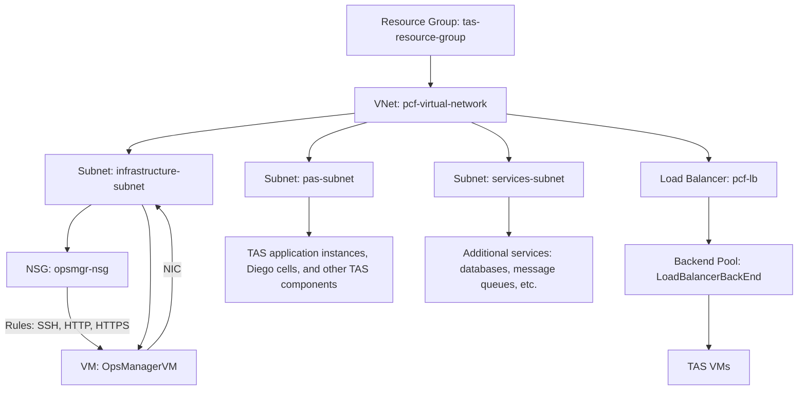

# TAS-Azure-Install

This repository hosts AZ CLI scripts and comprehensive guidelines for deploying VMware Tanzu Application Service (TAS) on Microsoft Azure. It strictly adheres to the official VMware documentation to ensure a secure and optimized environment setup.

## Contents

- **Network Setup:** AZ CLI scripts to create resource groups, virtual networks, subnets, and network security groups (NSGs).
- **Storage Configuration:** Instructions for creating and configuring Azure storage accounts and containers.
- **Ops Manager Deployment:** Steps to download, upload, and configure the Ops Manager VHD.
- **Load Balancer Setup:** Scripts to create and configure load balancers for TAS.
- **BOSH Director and TAS Deployment:** Guidance on configuring BOSH Director and deploying TAS on Azure.

## Infrastructure Diagram

## Usage

Utilize the provided AZ CLI scripts and follow the instructions in order to methodically set up your TAS environment on Azure.
